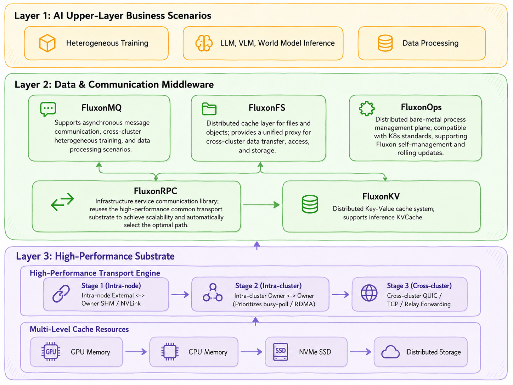
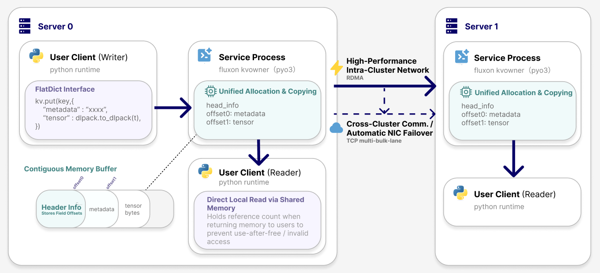
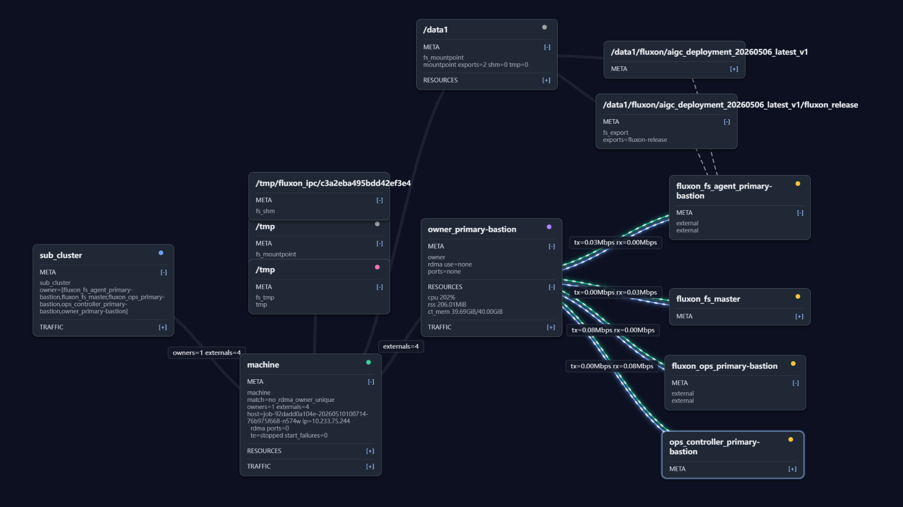
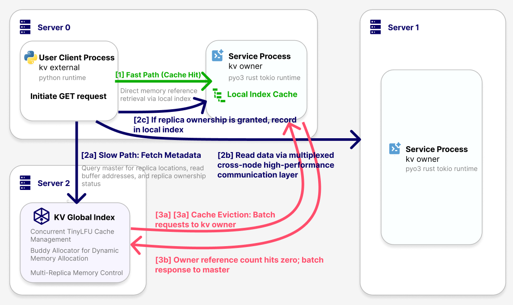
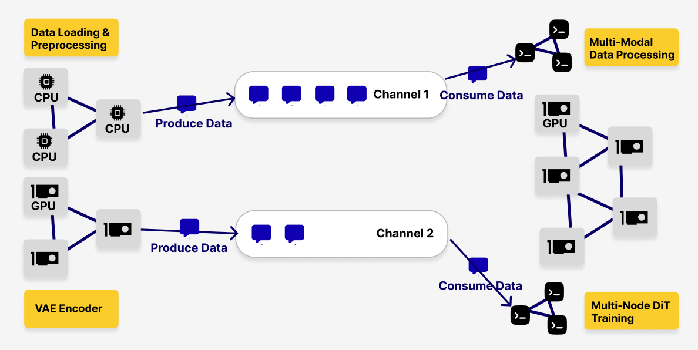
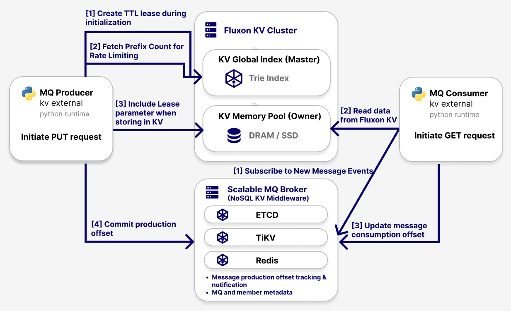
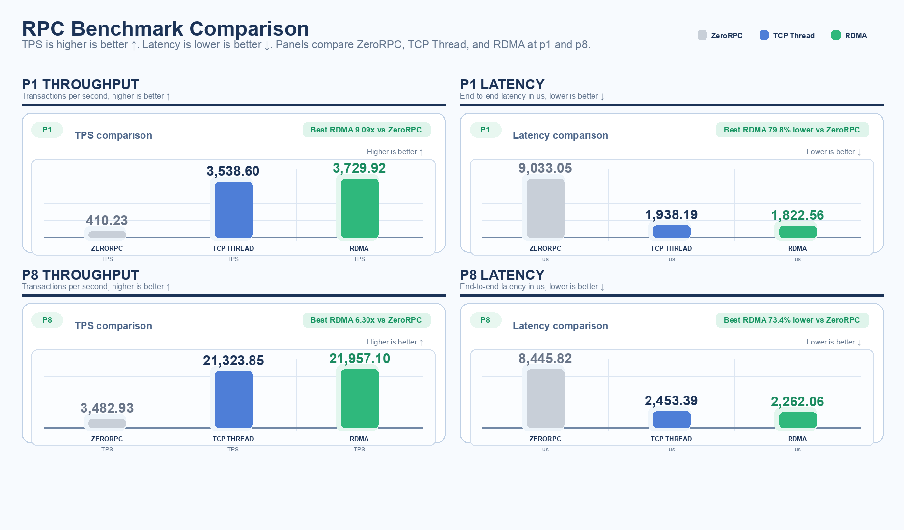
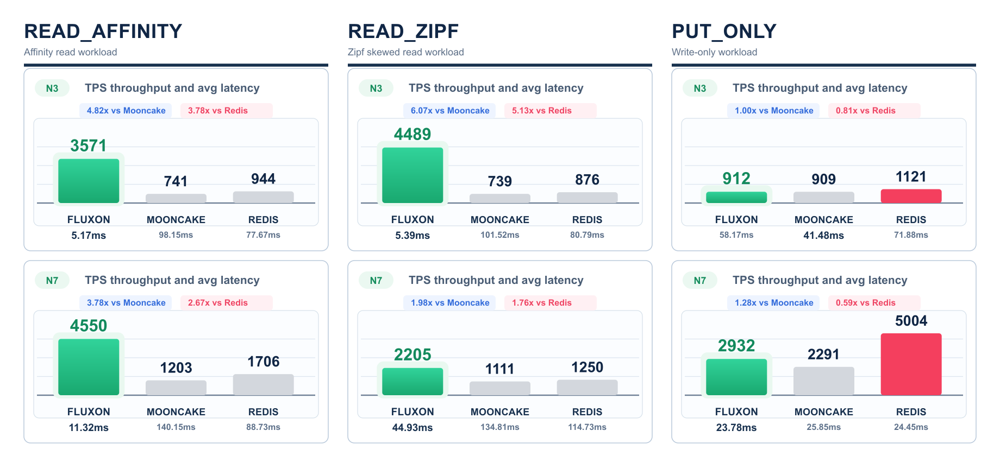
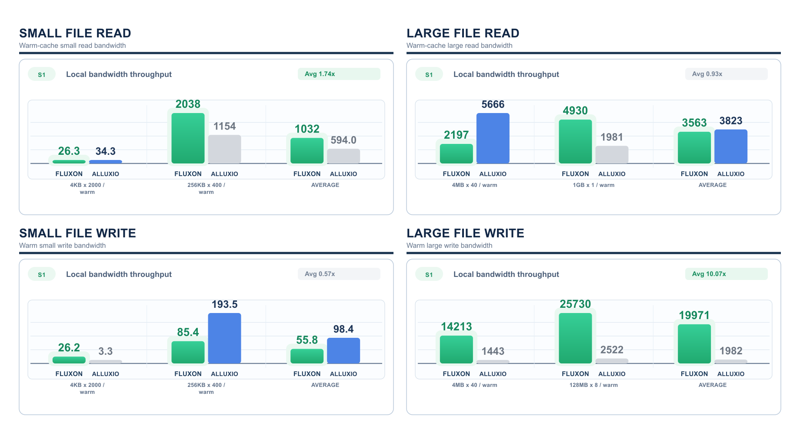

# Fluxon


<div align="center">

[](#runtime-requirements)
[](#runtime-requirements)
[](./fluxon_rs/rust-toolchain.toml)
[](./fluxon_release)
[](#interface-capabilities)

[English](./README.md) | [中文](./README_CN.md) | [Docs](https://tele-ai.github.io/Fluxon/) | [中文文档](https://tele-ai.github.io/Fluxon/cn/) | <a href="https://github.com/Tele-AI/Fluxon" title="GitHub Repository"></a>

</div>

As GPU compute power continues to scale, bottlenecks in AI systems are expanding from individual operators into the data plane. Inference services need cross-node `KV Cache` reuse. Training pipelines need to pass intermediate state across heterogeneous resource pools. Model files and `Checkpoint` data need to move reliably between remote access paths and local caches.

Most existing systems, however, are still specialized components built for narrow scenarios, such as `MooncakeStore` for `KV Cache`. Many AI workloads still lack mature `AI-native` infrastructure components, so algorithm teams often assemble temporary data transfer modules just to validate ideas quickly. As model scale and cluster elasticity grow together, the cost of this patchwork data plane keeps expanding, consuming CPU, I/O, memory, and operational effort, and exposing seven critical engineering pain points:

- **Poor generalization of domain-specific designs:** specialized `KV Cache` systems bind cache semantics and `RDMA` transport to a narrow path, which makes them hard to carry over into more general data-plane scenarios
- **Lack of unified resource governance:** framework-level `L2` and external `L3` caches often live in the same host `CPU` memory, while `L2` remains outside unified indexing and eviction control, increasing cache-crossing overhead
- **Absence of a shared-memory fast path for local processes:** many current data paths are organized around `RDMA` / `TCP`, so object handoff between colocated `Workers` still detours through the network protocol stack
- **Lack of a dynamically elastic `AI Infra` communication plane:** handoff across resource pools needs dynamic membership and asynchronous transfer, while fixed-member communication models amplify connection-management and recovery complexity
- **Tight coupling between business processes and data-plane governance:** when business processes start and stop dynamically while also contributing capacity, they trigger `Rebalance` churn and connection storms in the data plane
- **Fragmented object lifecycle management:** caches, messages, and files each maintain their own reference and eviction state, and those states easily fragment across business frameworks, cache layers, and transport layers
- **Fragmented observability pipelines:** cache hits, transport paths, and object materialization are scattered across separate systems, so performance debugging becomes an exercise in stitching clues together from multiple metric sets

Fluxon is designed around these problems. It separates data-plane resources, object lifecycles, cross-node transport, and business integration into explicit abstractions, then governs them on one unified storage and transport foundation so more system budget goes to model computation instead of data-plane assembly and movement. Built on that unified Rust-based storage and transport foundation, Fluxon exposes three standardized interfaces that target the core bottlenecks in AI systems:

- **KV/RPC (Unified key-value and RPC)**: Breaks data silos and enables efficient cross-process, cross-node reuse of inference-side `KV Cache` and `latent cache`
- **MQ (Elastic message queue)**: Decouples system dependencies and supports elastic message transport across heterogeneous resource pools
- **FS (`S3`-compatible file, object, and cache acceleration system)**: Unifies multi-form storage so one system can cache key-value, file, and object data, while supporting remote access, `S3` forwarding, and large-scale cross-cluster migration for AI data and model files



## Acknowledgements

Fluxon learns from and builds on ideas and components from projects including `pplx-gardon`, `iceoryx`, `Alluxio`, `Mooncake`, and `Moka`: local IPC and shared-memory paths, large-object data-plane design, cache governance, and AI-oriented data movement.

<a id="contents"></a>

## 🧭 Contents

- [Foundation Capabilities](#foundation-capabilities)
- [Interface Capabilities](#interface-capabilities)
- [Benchmark](#benchmark)
- [Runtime Requirements](#runtime-requirements)
- [Quick Start](#quick-start)
- [Repository Structure](#repository-structure)
- [Contributing](#contributing)
- [Contributors](#contributors)
- [License](#license)
- [Stargazers over time](#stargazers-over-time)

<a id="foundation-capabilities"></a>

## 🧱 Foundation Capabilities

- **End-to-end Rust:** consolidates connection handling, protocol encoding/decoding, state-machine progression, shared-memory management, and observability collection into Rust hot paths, reducing hot-path jitter from interpreted execution, cross-language boundaries, and uncontrolled copying
- **Unified storage and transport:** places storage and transport on one converged data plane, prioritizes the cross-process shared-memory fast path, and reduces fragmentation between object lifecycle management and transport behavior
- **High-performance inter-node transport:** prefers `RDMA` inside the cluster, supports automatic `TCP` fallback, and allows NICs to be enabled, disabled, and switched dynamically from the `GUI`, which lowers availability risk when one transport path degrades
- **Automatic inter-node relay:** supports automatic `relay` / forwarding across nodes and sub-clusters, reducing the integration cost of complex network topologies
- **Global memory allocation and governance:** uniformly manages global memory allocation, object lifecycles, capacity boundaries, and reclamation policies to avoid fragmentation and uncontrolled growth
- **Unified role model:** `Master`, `Owner Client`, and `External Client` cooperate in layers, organize control-plane and data-plane responsibilities into a scalable tree topology, and decouple business processes from data-plane governance to reduce `Rebalance` churn and connection storms
- **Unified object interface:** lets the system organize multi-field objects uniformly, balancing API flexibility, ease of use, and room for low-level optimization while keeping lifecycle state from scattering across layers
- **Tensor-native zero-copy handoff path:** facilitates the reuse of high-frequency tensor objects across caching and transport paths, eliminating the overhead of routing local process handoffs through the network stack
- **Unified observability:** uses the `Prometheus` protocol and `Greptime` to consolidate `metric / trace / log`, and includes a built-in `GUI` for cluster member state, log information, key metrics, and topology, which helps close observability gaps across systems
- **Shared capabilities across all three interfaces:** `KV/RPC`, `MQ`, and `FS` reuse the same caching, transport, lease, capacity-governance, and observability substrate, avoiding duplicated data-plane stacks for adjacent workloads





<a id="interface-capabilities"></a>

## 🔌 Interface Capabilities

### Fluxon KV/RPC

Designed for world model inference caches, state sharing, service-to-service calls, and tensor object reuse. In scenarios such as multi-view latent-space prediction, state extrapolation, and prefix-cache reuse, Fluxon KV/RPC provides a more general AI data plane rather than a niche solution limited to a single `KV Cache` use case.

- Local cache replicas and eventually consistent read path: prioritizes local fast-path hits while synchronizing metadata asynchronously in the background
- Batched reclamation and hot-object management: advances invalid-object cleanup asynchronously through `batch_delete`, and combines it with `TinyLFU` to reuse hot objects more efficiently
- Simultaneous control over `L2` and `L3` in AI workloads: keeps global data objects indexed, discoverable, and reusable, reducing redundant memory waste from duplicate residency across cache tiers
- KV and RPC synergy: the same parameter organization, caching, and communication foundation serves both state storage and service-to-service calls



### Fluxon MQ

Designed for heterogeneous training, data-processing pipelines, and intermediate-state handoff across resource pools. When the `Producer` side and `Consumer` side are split across different machines, different resource pools, or even different sub-clusters, Fluxon MQ consolidates message retention, capacity governance, and cross-cluster placement into one unified messaging layer.

- `Lease`-based retention semantics: binds message retention to the `channel`, ensuring data has bounded-time reliable retention before actual consumption
- `channel`-level prefix statistics and capacity governance: continuously tracks message counts and capacity usage boundaries for scaling and traffic control
- Cross-cluster load-aware placement: uses `Consumer`-side location to decide `Payload` placement, shortening prefetch paths and stabilizing throughput
- Co-designed with KV: message shells and member metadata stay on the control plane, while large `Payload` objects stay on the `FluxonKV` data plane, avoiding the need to build a second large-object transport stack





### Fluxon FS

Fluxon FS is a high-performance, S3-compatible file and object cache for AI data and model files. It supports read/write acceleration, remote access, `S3` forwarding, cache hits, and large-scale cross-cluster migration. In workloads with high-resolution video, trajectory samples, `Checkpoint` data, and other large file objects, Fluxon FS unifies these complex data flow and acceleration demands into a single data plane.

- Unified caching system: directly reuses `FluxonKV/RPC` caching and communication capabilities, splits files into `KeyValue` shards, and lets one system support accelerated reads and writes for key-value, file, and object caching
- `S3` forwarding access: supports object-storage access and forwarding for AI data and model files
- Transparent Python file semantics: preserves the upper-layer `open() / read() / write()` experience as much as possible while reducing system-call and cross-process overhead
- Specialized optimization for small-file / large-file reads and writes: optimizes concurrency and transport paths by file granularity and read / write path to improve bandwidth utilization and overall throughput
- Large-scale cross-cluster migration: supports `PB`-scale data migration and keeps caching, transport, and failure recovery in one unified path

<a id="benchmark"></a>

## 📊 Benchmark

The benchmark section mainly covers the `RPC`, `KV`, and `FS` data planes, and the related scripts and configurations are primarily under `fluxon_test_stack/`.

### Fluxon RPC Benchmark

The RPC benchmark mainly shows call latency and throughput across different message sizes and concurrency levels, to observe the stability and tail-latency behavior of the service-to-service call path.



### Fluxon KV Benchmark

The `TCP Benchmark` shows that Fluxon outperforms `MooncakeStore` and `Redis` on the two read-heavy workloads `Read-affinity` and `Read-Zipf`. For `put_only`, the current primary constraint remains the inflight metadata deduplication path rather than `Payload` transport.



### Fluxon FS Benchmark

The benchmark results show that small-file reads and large-file writes already outperform `Alluxio`, large-file read performance is broadly on par, and small-file write performance still has further room to improve.



### Fluxon MQ Benchmark

`MQ` currently focuses mainly on scenario problems and data-plane design. The automated runtime entrypoints are `test_runner.py` and `fluxon_test_stack/`.

<a id="runtime-requirements"></a>

## 🧰 Runtime Requirements

**For Quick Start (`Docker`):**

- Docker installed
- The Quick Start image bundles the middleware required by the demo flows

**For production deployment or building from source:**

- **OS**: Linux only
- **Python**: `>= 3.10`
- **Rust**: Toolchain pinned to `1.93.0`; see [fluxon_rs/rust-toolchain.toml](./fluxon_rs/rust-toolchain.toml)
- **External middleware**:
  - The minimal control plane requires `etcd` and `Greptime`
  - `FluxonFS` features such as directory transfer and pre-scan that persist task state also require `TiKV PD` and `TiKV`
- **Docker**: Required for Quick Start image workflows and runtime packaging workflows

<a id="quick-start"></a>

## 🚀 Quick Start

Quick Start is the shortest path to try Fluxon. For formal installation, deployment, and operations, see [User Docs](https://tele-ai.github.io/Fluxon/user_doc/).

### KV Quick Start

```bash
docker run --rm -it --network host \
  hanbaoaaa/fluxon_quick_start:0.2.1 \
  --mode kv \
  --etcd-client-port 12379 \
  --master-p2p-port 31000 \
  --panel-port 18080 \
  --greptime-http-port 14000 \
  --kv-http-port 8083
```

Once inside, you can type:

```text
put demo:hello world
get demo:hello
del demo:hello
```

Expected runtime view:


Open the link printed in the terminal to access the `KV Web UI`:


Related interface docs:

- [KV and RPC Interface](https://tele-ai.github.io/Fluxon/user_doc/User---3---KV-and-RPC-Interface/)

### MQ Quick Start

```bash
docker run --rm -it --network host \
  hanbaoaaa/fluxon_quick_start:0.2.1 \
  --mode mq \
  --etcd-client-port 37379 \
  --kv-master-port 34200 \
  --greptime-http-port 14000 \
  --panel-port 18080
```

Once inside, you can type:

```text
put hello
put world
exit
```

The background `Consumer` keeps printing received messages.  
Startup also prints the `MQ Web UI` address.

Expected runtime view:


Related interface docs:

- [MQ Interface](https://tele-ai.github.io/Fluxon/user_doc/User---4---MQ-Interface/)

### FS Quick Start

```bash
docker run --rm -it --network host \
  hanbaoaaa/fluxon_quick_start:0.2.1 \
  --mode fs \
  --etcd-client-port 36379 \
  --kv-master-port 34100 \
  --greptime-http-port 14000 \
  --panel-port 34180
```

Once inside, you can type:

```text
ls
echo "hello fs" > notes.txt
cat notes.txt
ui
```

`FS Quick Start` additionally prints:

- `fs_s3` endpoint
- `Basic Auth` entry; the default username / password is `admin / admin`

Expected runtime view:


Open the link printed in the terminal to access the `FS Web UI`:


Related interface docs:

- [FS Interface](https://tele-ai.github.io/Fluxon/user_doc/User---5---FS-Interface/)

<a id="repository-structure"></a>

## 🗂️ Repository Structure

- `fluxon_rs/`: Rust core implementation and low-level capabilities
- `fluxon_py/`: Python interfaces, runtime, and bindings
- `deployment/`: deployment and operations toolchain
- `scripts/`: utility scripts and helper entrypoints
- `setup_and_pack/`: entrypoints for packaging and release preparation
- `examples/fluxon_quick_start/`: minimal runnable environment entrypoint
- `fluxon_test_stack/`: test stack, benchmarks, and gitops entrypoint

<a id="contributing"></a>

## 🤝 Contributing

Contributions are welcome. Before you start, please read the developer docs on GitHub Pages:

- [Developer Docs](https://tele-ai.github.io/Fluxon/dev_doc/)
- [Developer - 1 - Package core install artifacts](https://tele-ai.github.io/Fluxon/dev_doc/Developer---1---Package-Core-Install-Artifacts/)
- [Developer - 2 - Package middleware and images](https://tele-ai.github.io/Fluxon/dev_doc/Developer---2---Package-Middleware-and-Images/)
- [Developer - 3 - Documentation Writing Rules](https://tele-ai.github.io/Fluxon/dev_doc/Developer---3---Documentation-Writing-Rules/)
- [Developer - 4 - Publish a release](https://tele-ai.github.io/Fluxon/dev_doc/Developer---4---Publish-a-Release/)

<a id="contributors"></a>

## 👥 Contributors

<a href="https://github.com/Tele-AI/Fluxon/graphs/contributors">
  
</a>

Some earlier contribution records are no longer fully reflected in the current commit history. Historical highlights:

<p>
  <a href="https://github.com/yxrxy"></a>
  <a href="https://github.com/zTz01"></a>
  <a href="https://github.com/pakkah"></a>
  <a href="https://github.com/unity1263"></a>
  <a href="https://github.com/mumupika"></a>
  <a href="https://github.com/maplestarplayl"></a>
  <a href="https://github.com/RuileLu"></a>
  <a href="https://github.com/Summage"></a>
</p>

- `yxrxy`: FluxonFS implementation and optimization
- `zTz01`: `KV Cache` optimization
- `pakkah`: RDMA support, VLM exploration
- `unity1263`: `KV` shared-memory design integration, `Benchmark` toolchain
- `mumupika`: Initial MQ implementation
- `maplestarplayl`: IPC integration, SPDK integration
- `RuileLu`: `KV Lease` support
- `Summage`: Initial KV architecture optimization

<a id="license"></a>

## 📄 License

Fluxon is open-sourced under Apache License 2.0, see [LICENSE](./LICENSE).

<a id="stargazers-over-time"></a>

## ⭐ Stargazers over time

[](https://www.star-history.com/?repos=Tele-AI%2FFluxon&type=date&legend=top-left)
