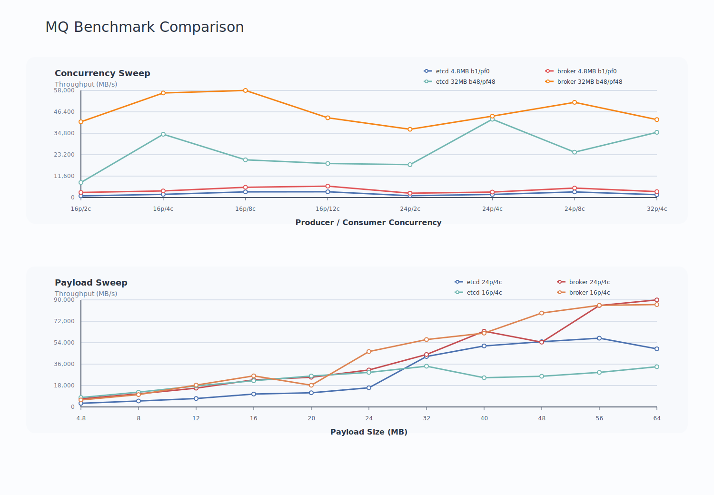

# FluxonMQ：一次 AI 大 Payload 消息队列的控制面重构

AI 训练和推理系统里的消息队列，处理的已经不再是几 KB 的业务事件。在 VAE 解耦训练、数据处理流水线、多模态中间态传递和跨资源池任务交接里，producer 传出去的往往是几十 MB 甚至更大的张量 Payload。consumer 可能动态加入、退出、扩缩容，也可能分布在不同机器、资源池或子集群。FluxonMQ 服务的就是这类场景：让 producer 和 consumer 通过消息语义解耦，同时让大 Payload 继续利用 Fluxon KV owner 的共享内存和跨节点传输路径。

在这个设计里，MQ 层负责消息状态，KV 数据面负责 Payload。其中消息状态覆盖消息可见性、in-flight 归属、提交确认、失败重投和清理确认。Payload 保存在 KV owner 管理的内存和传输路径中，consumer 拿到消息后通过 Payload key 读取数据。这种分工让 MQ 可以承载大对象交接。

早期 FluxonMQ 使用 etcd 推进消息状态。producer 写入 Payload 后，把消息可见状态写到 etcd；consumer 从 etcd 扫描和抢占消息，读取 Payload 后再写回消费进度。这条路径结构清晰，也复用了 etcd 的一致性和租约能力。问题出现在高并发热路径上：每条消息周围的 ready、claim、inflight、offset、commit 都会形成控制面读写。Payload 传输还在 KV owner 中进行，但消息能否被及时发现、抢占和提交，开始受 etcd 状态推进速度限制。

这次 broker 优化针对的就是这段控制面热路径。etcd 仍然负责成员发现、租约、broker 发现和 channel 长期元数据；broker 接管每条消息的排队、抢占、提交、失败放回和清理确认；KV owner 继续负责 Payload 存储和传输。这个拆分把低频集群元数据和高频队列状态分开，让消息推进从外部 KV 存储操作转为 broker 内存状态更新。

## 基础链路：Payload 在 KV，状态在队列

早期链路的关键是把 Payload 和消息状态分离。producer 先把大对象写进 KV owner，再把指向 Payload 的消息状态写入 etcd。consumer 从 etcd 扫描可消费消息，完成抢占后拿到 Payload key，再从 KV owner 读取实际数据，处理完成后把消费进度写回 etcd。etcd 只保存消息状态和进度，避免承担大对象存储压力。

随着 producer 和 consumer 数量增加，队列状态推进会成为更明显的成本。consumer 为了保持吞吐，会提高 batch size 和 prefetch 深度。prefetch 可以提前发起查找和抢占，但它并没有减少 etcd 上的控制面操作，只是把这些操作前移。高并发下，本地 inflight 能否填深，取决于 etcd 能否持续快速完成可见消息查找、抢占和提交推进。

broker 链路把这些状态推进移到 broker 内部。producer 写入前先向 broker 申请 reservation。reservation 是一次写入尝试的占位，broker 返回 `reservation_id` 和 `msg_id`，并记录这条消息预计占用的 Payload bytes。Payload 写入 KV owner 成功后，producer 调用 `publish`，消息进入可消费队列。Payload 写失败时，producer 调用 `abort`，broker 释放占位和字节预算。这个顺序保证了 consumer 只能看到已经写入成功的 Payload。

consumer 通过 `fetch` 获取消息。broker 将消息从可消费队列移动到 in-flight，并返回 Payload key。in-flight 表示消息已经被某个 consumer 拿走，但还没有确认消费完成。consumer 读取 Payload 并完成处理后调用 `commit`，这一步成功后，broker 才认为这条消息已经完成消费。后续 Payload 删除或释放完成后，consumer 再发送 `cleanup ack`，broker 释放对应的清理状态。consumer 失败、超时或被取消时，未 commit 的消息会重新放回可消费队列，等待后续投递。

这个流程把每条消息的状态推进留在 broker 内存中。`fetch`、`commit`、`requeue` 和 `cleanup ack` 都通过 P2P RPC 调用 broker，broker 更新本地状态后返回结果。etcd 从消息热路径中退出，只处理成员、租约和发现这类低频职责。

## broker 的进程边界

broker 作为独立进程运行，长期维护 MQ 队列状态。它的生命周期独立于 producer、consumer 和 KV owner。master 继续负责集群控制、租约和 owner 管理，broker 负责高频消息排队。把 broker 放在独立进程里，可以避免 MQ 热路径占用 master，并减少 master 故障和 MQ 队列状态之间的耦合。

当前实现中，broker 底层通信身份复用 external client，没有新增 closed runtime 角色。MQ 业务身份通过 member metadata 中的 `fluxon_mq_component=broker` 标记。broker 不注册 segment，不贡献共享内存，也不拥有 Payload。producer 和 consumer 通过 broker discovery 找到 broker，再用 P2P RPC 调用 broker。

这个边界保留了 Fluxon 现有通信层结构。broker 不会被 master 当作 KV owner 等待 segment 注册，P2P relay 和 external client 接入规则也可以继续复用。MQ 增加了一个控制面进程，但没有扩展一套新的底层角色体系。

## 实现结构

Rust 侧的 broker 状态位于 `fluxon_rs/fluxon_mq/src/broker.rs`。它维护 `pending`、`visible`、`inflight`、`cleanup` 和 `cleanup_inflight` 等队列。`pending` 保存已 reserve 但尚未 publish 的消息，`visible` 保存可被 consumer 获取的消息，`inflight` 保存已 fetch 但尚未 commit 的消息，`cleanup` 和 `cleanup_inflight` 保存已提交但仍等待 Payload 清理确认的消息。broker 保存消息信封、Payload key、容量计数和字节预算，不保存 Payload bytes。

producer 热路径位于 `fluxon_rs/fluxon_mq/src/producer.rs`。新的写入流程是 `reserve`、写 KV Payload、`publish`。当 broker 满或 Payload byte budget 满时，producer 在 Rust 热路径内退避重试，避免把可恢复的背压错误抛到 Python 外层，再由 Python 固定 sleep 后同步重试。这个调整减少了高并发下的 RPC 冲击，也让 producer 的等待逻辑更贴近真实队列状态。

consumer 热路径位于 `fluxon_rs/fluxon_mq/src/consumer.rs` 和 `fluxon_rs/fluxon_pyo3/src/mpsc.rs`。consumer 从 broker `fetch` 消息，读取 Payload，随后 `commit` 并执行 cleanup。Python 层主要负责 API 包装、bench 编排和 teardown；消息推进已经迁移到 Rust 和 broker 路径。

MPMC bench 的清理逻辑位于 `fluxon_py/tests/test_api_chan_mpmc/test_mpmc_simple_bench.py`。teardown 时会删除本轮 MPMC 子 MPSC channel，并继续删除 broker 返回的 Payload keys。这样可以同时释放 broker byte budget 和 KV owner 中的实际 Payload，避免连续 case 后 owner pool 被旧数据占住。

## 性能结果

测试环境为单机，owner pool 为 `100GB`，channel capacity 为 `4096`，低日志运行，Payload 为 DLPack 数据。对比对象是 etcd 队列推进和 broker 队列推进，两边使用相同的 producer、consumer、batch、prefetch 和 Payload 参数。

| case | P/C | batch/prefetch | Payload | etcd MB/s | broker MB/s | 变化 |
| --- | ---: | ---: | --- | ---: | ---: | ---: |
| 01 | 16/8 | 40/40 | 4.8MB | 7660.80 | 8010.24 | +4.6% |
| 02 | 16/12 | 40/40 | 4.8MB | 7372.80 | 9496.80 | +28.8% |
| 03 | 24/8 | 40/40 | 4.8MB | 7046.40 | 7350.24 | +4.3% |
| 04 | 16/8 | 40/120 | 4.8MB | 6931.20 | 9791.52 | +41.3% |
| 05 | 16/4 | 40/40 | 4.8MB | 7756.80 | 8294.40 | +6.9% |
| 06 | 16/2 | 40/40 | 4.8MB | 6201.60 | 5875.20 | -5.3% |
| 07 | 16/4 | 48/48 | 4.8MB | 7925.76 | 8155.68 | +2.9% |
| 08 | 16/4 | 64/64 | 4.8MB | 7802.88 | 8382.24 | +7.4% |
| 09 | 16/4 | 48/48 | 8MB | 12441.60 | 14153.60 | +13.8% |
| 10 | 16/4 | 48/48 | 12MB | 17625.60 | 18356.40 | +4.1% |
| 11 | 16/4 | 48/48 | 16MB | 22041.60 | 26102.40 | +18.4% |
| 12 | 16/4 | 48/48 | 20MB | 26016.00 | 18222.00 | -30.0% |
| 13 | 16/4 | 48/48 | 24MB | 29030.40 | 46552.80 | +60.4% |
| 14 | 16/4 | 48/48 | 32MB | 34252.80 | 56624.00 | +65.3% |
| 15 | 24/4 | 48/48 | 32MB | 42393.60 | 44067.20 | +3.9% |
| 16 | 32/4 | 48/48 | 32MB | 35328.00 | 42198.40 | +19.4% |
| 17 | 24/2 | 48/48 | 32MB | 17817.60 | 36969.60 | +107.5% |
| 18 | 24/4 | 48/48 | 40MB | 51264.00 | 63656.00 | +24.2% |
| 19 | 24/4 | 48/48 | 48MB | 54835.20 | 54451.20 | -0.7% |
| 20 | 24/4 | 48/48 | 56MB | 57792.00 | 85254.40 | +47.5% |
| 21 | 24/4 | 48/48 | 64MB | 48844.80 | 89952.00 | +84.2% |

小 Payload 下，broker 的收益取决于并发组织。`16p/12c b40/pf40 4.8MB` 从 `7372.80 MB/s` 提升到 `9496.80 MB/s`，提升 `28.8%`；`16p/8c b40/pf120 4.8MB` 从 `6931.20 MB/s` 提升到 `9791.52 MB/s`，提升 `41.3%`。这些点的共同特征是 consumer 或 prefetch 对控制面推进的需求更强，broker 能让本地 inflight 更稳定地填起来。

大 Payload 下，控制面阻塞减少后，数据面更容易持续跑满。`24MB` 从 `29030.40 MB/s` 提升到 `46552.80 MB/s`，`32MB` 从 `34252.80 MB/s` 提升到 `56624.00 MB/s`，`56MB` 从 `57792.00 MB/s` 提升到 `85254.40 MB/s`，`64MB` 从 `48844.80 MB/s` 提升到 `89952.00 MB/s`。纯 etcd 路径的最佳点是 `24p/4c b48/pf48 dlpack 56MB`，稳态吞吐 `57792.00 MB/s`；broker 路径的最佳点是 `24p/4c b48/pf48 dlpack 64MB`，稳态吞吐 `89952.00 MB/s`。

## 结尾

FluxonMQ broker 优化把每条消息的高频状态推进从 etcd 迁到 broker，etcd 保留成员、租约、发现和长期元数据职责，KV owner 继续承载大 Payload 数据面。这个调整让 MQ 控制面更贴近消息运行时状态，也让 Payload 传输继续复用 Fluxon 的共享内存和跨节点数据路径。

在单机 `100GB` owner pool 测试中，etcd 路径最高 `57.79GB/s`，broker 路径最高 `89.95GB/s`。更重要的是，队列推进已经从外部 KV 存储读写变成内存状态机更新，为后续多 broker 分片、批量 RPC、跨节点 MQ 和更细粒度容量治理提供了更清晰的演进基础。
