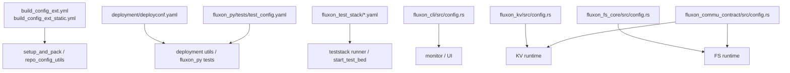

# Fluxon 配置总览

## 1. 结论

本文只回答一件事：Fluxon 仓库里有哪些稳定配置入口，它们各自负责什么，校验后会变成什么运行时结构。

**稳定结论：**

- 配置输入和运行时结构是分开的，YAML 只负责声明意图，`verify()` / `parse_*()` 负责收敛成唯一可执行结果。
- 共享契约优先放在 `fluxon_commu_contract` 和 `fluxon_cli::config` 这类公共模块里，业务包更多是复用或重导出。
- `host:port`、`http(s)://...`、`cluster-scoped path` 这几类格式都被严格区分，不靠探测或模糊回退。
- 仓库里的 checked-in YAML 分两类：运行时契约和环境/测试契约。前者要强校验，后者主要用于把开发、部署、测试流水线接起来。



## 2. 配置地图

| 配置家族 | 入口文件 / 模块 | 主要消费者 | 作用 |
| --- | --- | --- | --- |
| 仓库环境配置 | `build_config_ext.yml` | Rust KV 测试族、`fluxon_py/tests/test_lib.py`、`setup_and_pack` 打包/校验脚本、TestStack 的 `bin_kvtest` 用例 staging | 提供 etcd、Prometheus、remote write 等开发/测试基线 |
| 静态构建配置 | `build_config_ext_static.yml` | `setup_and_pack/pack_release.py`、`build_pack_fluxonkv_pylib_img.py`、Nix 打包链路 | 固定 wheel / manylinux 版本 |
| 部署配置 | `deployment/deployconf.yaml` | 部署脚本、`fluxon_py` 测试入口、TestStack 生成/消费链路 | 提供集群节点、服务地址和全局环境变量 |
| Python 测试配置 | `fluxon_py/tests/test_config.yaml` | `fluxon_py` 测试入口、测试辅助库、deployconf 解析链路 | 连接 deployconf，选择 KV backend 类型 |
| 开发/打包环境配置 | `setup_and_pack/setup_dev_env/*.yaml`、`setup_and_pack/build_pack_fluxonkv_pylib_img/*.yaml`、`setup_and_pack/nix/*.yaml`、`pub_prepare_build.yaml` | `setup_and_pack` 脚本 | 提供开发机和打包流水线的环境输入 |
| TestStack 配置 | `fluxon_test_stack/ci_test_list.yaml`、`start_test_bed.yaml`、`gitops.yaml` | `test_runner.py`、`start_test_bed.py` | 定义 suite、testbed、GitOps 和 UI 入口 |
| CLI 监控配置 | `fluxon_cli/src/config.rs` | `master_ui_monitor`、`test_runner_ui` | 提供监控页和查询页配置 |
| KV 配置 | `fluxon_kv/src/config.rs` | KV master / owner / external | 定义 KV 运行时角色和校验规则 |
| FS 配置 | `fluxon_fs_core/src/config.rs` | FS master / agent / panel | 定义 FS cache、master、panel、权限和转移态 |
| 共享传输配置 | `fluxon_commu_contract/src/config.rs`、`transfer_engine/surface.rs` | KV / FS / commu | 提供 `NetworkConfig`、`ProtocolType`、`TransferEngineType` |

## 3. 通用规则

| 规则 | 含义 |
| --- | --- |
| `serde(deny_unknown_fields)` | 运行时 YAML 默认拒绝未知字段 |
| `from_file` / `from_str` + `verify` | 先解析，再收敛成强类型运行时配置 |
| `YamlNullable<T>` | 只在需要区分“缺失 / null / value”时使用 |
| `host:port` 与 `http(s)://...` 分离 | etcd / deployconf 常用前者，监控 / Prometheus 常用后者 |
| 派生值要显式写回 | 例如 cluster-scoped 路径、默认表名、默认 transport_mode |

## 4. 环境与部署配置

### 4.1 `build_config_ext.yml`

这是仓库级开发环境配置，不是业务 runtime config。

最小骨架：

```yaml
# Rust / Python / 测试工具共用的 etcd 地址
# 输入要求 raw host:port
etcd: 127.0.0.1:43579

# Prometheus-compatible 查询入口
prom: http://127.0.0.1:44030/v1/prometheus

# remote write 入口
prom_remote_write_url: http://127.0.0.1:44030/v1/prometheus/write
```

这里的重点不是字段多，而是格式严格分层：

- `etcd` 用 raw `host:port`。
- `prom` 用带 scheme 的 HTTP URL，并且路径通常是 `/v1/prometheus` 或 `/api/v1`。
- `prom_remote_write_url` 也是完整 URL。

`setup_and_pack/utils/repo_config_utils.py` 里保留了 `prometheus_remote_write_url` 的旧名兼容读取，但这是 build tooling 的过渡路径，不是推荐的新契约。

### 4.2 `build_config_ext_static.yml`

当前最小骨架只有一个稳定字段：

```yaml
manylinux_version: "2_28"
```

当前实现只接受 `2_28`。

### 4.3 `deployment/deployconf.yaml`

这是部署和打包流水线的核心配置。先看最重要的骨架：

```yaml
namespace: fluxon-example
name_prefix: fluxon-example
image: fluxon_quick_start:0.2.1

cluster_nodes:
  - hostname: example-node-a
    ip: 192.0.2.10
    hostworkdir: /opt/example/fluxon/deployment/example_deploy
    mounts:
      - /opt/example/fluxon: /fluxon_mount
      - /var/run/docker.sock: /var/run/docker.sock

global_envs:
  FLUXON_CLUSTER_NAME: "fluxon-example-cluster"
  FLUXON_SHARED_MEM: "${HOSTWORKDIR}/shm1"
  ETCD_FULL_ADDRESS: "${${ETCD__NODE_ID}__IP}:${ETCD__PORT}"
  FLUXON_PROMETHEUS_BASE_URL: "http://${${GREPTIME__NODE_ID}__IP}:${GREPTIME__PORT}/v1/prometheus"
  MONITOR_GREPTIMEDB_WRITE_URL: "http://${${GREPTIME__NODE_ID}__IP}:${GREPTIME__PORT}/v1/prometheus/write"

release_ext_images:
  etcd:
    image: quay.io/coreos/etcd:v3.5.0
  greptime:
    image: greptime/greptimedb:v0.15.1
```

读这份配置时，先抓住三层：

- `cluster_nodes` 提供节点清单，是 placeholder 解析的基础。
- `global_envs` 提供集群级 authority，比如 etcd、Prometheus、cluster name、shared roots。
- `release_ext_images` 和后续 service/workload 块把这些 authority 接进具体部署动作。

`global_envs` 允许占位符解析，先由 `cluster_nodes` + `service` 构造映射，再把变量落成最终值。

### 4.4 `fluxon_py/tests/test_config.yaml`

这是一层测试入口配置，不是 runtime 部署配置。

最小骨架：

```yaml
deployconf_path: ../../deployment/deployconf.yaml
kv_svc_type: fluxon
```

这里没有复杂分支：

- `deployconf_path` 指向共享 deployconf。
- `kv_svc_type` 选择测试要接的 KV backend；当前 checked-in 样例用的是 `fluxon`。

测试代码里还保留了 mooncake 相关读取函数，但 checked-in 的最小样例只使用上面两个字段。

### 4.5 `fluxon_test_stack/*`

TestStack 有三份主配置，建议直接从 YAML 骨架理解：

`ci_test_list.yaml` 定义 suite / scene 空间：

```yaml
schema_version: 9

run:
  mode: full_once
  selectors:
    case_ids: ALL
    profile_ids: [fluxon_fastws, fluxon_tquic, fluxon_sockudo_ws, fluxon_tcp]
    command_ids: ALL
    test_ids: ALL

scenes:
  kv_read_heavy_zipf:
    test_stack:
      mode: KVSTORE
      read_ratio: 0.9
      write_ratio: 0.1
      request_distribution: zipfian
    select:
      scales: [n1_kvowner_dram_20gib]
      profiles: [fluxon_tcp]
```

`start_test_bed.yaml` 定义 testbed authority 和 UI：

```yaml
schema_version: 6

deployconf_path: ./deployconf_testbed.yml
controller_url: http://192.0.2.10:19080/r/ops/fluxon_testbed
controller_basic_auth:
  username: example_admin
  password: example_password

test_runner_ui:
  enabled: true
  host: 0.0.0.0
  port: 18080
  workdir: ./test_runner_ui_runtime
  gitops_config_path: ./gitops/gitops.yaml

bootstrap_phases:
  - mode: fixed_bare
    node: infra44-ThinkStation-PX
    services: [etcd, greptime, tikv_pd, tikv]
```

`gitops/gitops.yaml` 定义 GitOps 轮询和触发命令：

```yaml
interval: 60

retention:
  max_age_days: 7

repos:
  - addr: git@github.com:Tele-AI/fluxon.git
    follow:
      - branch: big_step2
        run:
          name_prefix: fluxon_ci
          commands:
            - python3 fluxon_test_stack/pack_test_stack_rsc.py --all-profiles -c fluxon_test_stack/ci_test_list.yaml
            - python3 fluxon_test_stack/test_runner.py -c fluxon_test_stack/ci_test_list.yaml -w .
```

生成的 `deployconf_testbed.yml` 是派生产物，不是手工主配置。

## 5. 运行时配置

### 5.1 KV

KV 的入口在 `fluxon_kv/src/config.rs`。先记结论：`master` 单独使用 `MasterConfigYaml`；`owner` 和 `external` 共用 `ClientConfigYaml`；`verify()` 再按内存贡献把 client 配置收敛成 owner / external / side-transfer worker 三个运行时分支。

`master` 的最小骨架：

```yaml
instance_key: my-master-1
cluster_name: demo-kv-cluster

# master 控制面 etcd 地址；输入要求 raw host:port
etcd_endpoints:
  - 127.0.0.1:2379

# master 自己的日志 / profile 根目录
log_dir: /var/lib/fluxon/master_logs

# 可选；给出时必须 > 0
port: 31000

# 可选；当前 monitor 配置在 master 上是必填的
monitoring:
  prometheus_base_url: http://127.0.0.1:4000/v1/prometheus
  prom_remote_write_url:
    - http://127.0.0.1:4000/v1/prometheus/write
  otlp_log_api:
    otlp_endpoint: http://127.0.0.1:4000/v1/otlp/v1/logs

# 可选；配置后 KV Web UI 会作为 master 内嵌 HTTP 服务启动
master_ui:
  http_listen_addr: 0.0.0.0:31100
```

`owner` 和 `external` 共用同一个 `ClientConfigYaml` 外壳，先看 `owner`：

```yaml
instance_key: my-owner-1

# 只要 dram > 0，就进入 owner 分支
contribute_to_cluster_pool_size:
  # 容量按 16 MiB 对齐
  dram: 1677721600
  vram: {}

fluxonkv_spec:
  cluster_name: demo-kv-cluster

  # 共享 bundle 根目录；运行时会拼成 cluster_name 作用域路径
  share_mem_path: /dev/shm/fluxon

  # owner 必须自己连接 etcd；输入要求 raw host:port
  etcd_addresses:
    - 127.0.0.1:2379

  # owner 必须声明自己属于哪个 sub-cluster
  sub_cluster: default

  # owner 必须声明大文件根目录列表；运行时按数组顺序选择第一个可用 root，
  # 日志和 cache 等子目录都从固定相对位置派生
  large_file_paths:
    - /var/lib/fluxon/large

  # 可选
  p2p_listen_port: 31001

  # 可选；Redis 兼容入口只允许 owner 配
  # redis_compat:
  #   listen_addr: 0.0.0.0:6379
```

`external` 用的还是 `ClientConfigYaml`，但结构会更小：

```yaml
instance_key: my-external-1

fluxonkv_spec:
  cluster_name: demo-kv-cluster

  # external 只保留 attach owner 所需的共享 bundle 根目录
  share_mem_path: /dev/shm/fluxon

  # 可选
  p2p_listen_port: 31002
```

这里最重要的差异不是“多几个字段”，而是配置责任不同：

- `owner` 负责提供共享内存池、连接 etcd、声明 `sub_cluster`、发布 `shared.json`、给出日志和 cache 的大文件根目录。
- `external` 不再声明 `etcd_addresses`、`sub_cluster`、`large_file_paths`、`redis_compat`；这些 owner 侧字段都从 owner 发布的 `shared.json` 继承。
- `etcd_addresses` 在 owner 侧会同时保留两份视图：对外契约还是 raw `host:port`，运行时内部会归一化成 `http://host:port`。

主要约束：

- `monitoring` 在 master 上必填。
- `master_ui` 依赖 `monitoring`，并作为嵌入式 monitor HTTP 服务启动。
- `contribute_to_cluster_pool_size` 里的容量都按 16 MiB 对齐；`dram = 0` 但 `vram` 非 0 会被拒绝，避免半 owner 半 external 的模糊状态。
- owner 模式要求 `contribute_to_cluster_pool_size.dram > 0`，并且必须显式提供 `etcd_addresses`、`sub_cluster`、`large_file_paths`。
- zero-contribution `external` 模式禁止再写 owner 专属字段；运行时会从 owner `shared.json` 补齐这部分信息。
- `share_mem_path` 会拼成 `cluster_name` 作用域路径；`mmap.file`、`shared.json` 和 peer metadata 都位于这个 cluster-scoped 目录下。
- `test_spec_config.side_transfer_role = worker` 不是第三套 YAML，而是 zero-contribution client 的子分支；它强制 `TransferEngineType::P2p`，并关闭 transfer RPC fast path。
- `test_spec_config.side_transfer_worker_count` 只允许出现在 owner 配置里，用来控制 owner 拉起的 worker 数量。

更细的调用时序、持有生命周期和并发规则分别在 `kv_1_概览与分层.md`、`kv_2_调用时序.md`、`kv_3_参数与并发.md`、`kv_4_allocation_segment_holder生命周期.md` 里展开。

### 5.2 FS

FS 的配置集中在 `fluxon_fs_core/src/config.rs`，上层 `fluxon_fs/src/config.rs` 只是重导出。

这块分成 `cache`、`master`、`master_panel` 三个稳定子块，直接看骨架更直观：

```yaml
fluxon_fs:
  master:
    instance_key: fluxon_fs_master
    pull_interval_ms: 1000

  master_panel:
    listen_addr: 0.0.0.0:8091
    public_base_url: http://127.0.0.1:8091
    prometheus_base_url: http://127.0.0.1:4000/v1/prometheus
    auto_refresh_interval_secs: 10
    access_db_path: /var/lib/fluxon/fs_master_access.db
    bootstrap_access_model:
      users:
        - username: admin
          password: admin
          can_manage_users: true
      scope_access: []
    transfer_state_store:
      kind: tikv
      tikv:
        pd_endpoints:
          - 127.0.0.1:2379
        key_prefix: /fluxon_fs_transfer/
    s3_gateway:
      get_object_inflight_pieces: 8
      kv_miss_policy: remote_read

  cache:
    stale_window_ms: 5000
    write_session_target_inflight_bytes: 134217728
    rules:
      - dir_abs: /var/lib/fluxon/local_shared
        cache_mode: read_through
        write_mode: write_through
        kv_key_prefix: /fluxon_fs_cache/local_shared/
        bytes_field_key: bytes
        max_cache_bytes: 1048576
        on_refresh_error: apply_stale_window
    exports:
      demo:
        remote_root_dir_abs: /var/lib/fluxon/export_root
        nodes:
          - fluxon_fs_writer
        cache_max_bytes: 1048576
```

读这段时抓三个点：

- `fluxon_fs.master` 很小，当前稳定字段只有 `instance_key` 和可选的 `pull_interval_ms`；旧的 `fluxon_fs.rpc` 和 `rpc_timeout_ms` 已移除。
- `fluxon_fs.master_panel` 负责 UI/S3 授权和 transfer 状态；`listen_addr`、`public_base_url`、`prometheus_base_url`、`access_db_path`、`bootstrap_access_model`、`s3_gateway` 都是启动基线。
- `fluxon_fs.cache` 负责目录级 cache / export 规则；`rules[*].dir_abs` 和 `exports[*].remote_root_dir_abs` 都必须是绝对路径。

还要记住两个分支规则：

- `exports.<name>.nodes` 缺失时，路由模式是 `AgentRegistry`；给出时是 `StaticNodes`。
- `write_session_target_inflight_bytes` 可缺省，默认 128 MiB；但给出时必须 `> 0`。

FS 还把访问模型拆成两层：

- `access_model` 是用户/权限的输入模型。
- `runtime_access_model` 是 runtime 使用的派生模型，密码会被哈希，不再原样保留。

### 5.3 CLI 监控

`fluxon_cli/src/config.rs` 定义统一监控页配置，KV 的 `master_ui` 和 TestStack 的 UI 都复用它。

最小骨架：

```yaml
etcd_endpoints:
  - http://127.0.0.1:2379

prometheus_base_url: http://127.0.0.1:4000/v1/prometheus
cluster_name: demo-kv-cluster

# kv / mq / fs
member_kind: kv

# cli / web
output: web

# 可选；web 模式常用
http_listen_addr: 0.0.0.0:18080

# 可选；只有 MQ 页面需要扫描 unique key 时再给
# mq_unique_key_prefixes:
#   - /fluxon_mq_unique/

# 可选；不写时，如果 prometheus_base_url 明确指向 Greptime /v1/prometheus，
# 会自动派生默认 SQL 连接信息
# greptime_sql:
#   base_url: http://127.0.0.1:4000
#   db: public
#   log_table: fluxon_logs
```

主要约束：

- `etcd_endpoints` 必须非空且带 scheme。
- `prometheus_base_url` 必须带 scheme。
- `mq_unique_key_prefixes` 给出时不能为空，也不能带前后空白。
- `greptime_sql` 可以显式提供；如果 `prometheus_base_url` 指向 Greptime 的 `/v1/prometheus`，会自动派生默认 SQL 连接信息。

### 5.4 共享传输契约

`fluxon_commu_contract` 提供多个被 KV / FS 共同复用的基础类型：

最常见的是 `NetworkConfig` 这块 YAML：

```yaml
network:
  subnet_whitelist:
    - 127.0.0.0/8
    - 10.0.0.0/24
  primary_ip_to_extended_ips:
    10.0.0.10:
      - 10.0.0.11
      - 10.0.0.12
```

以及协议/传输分支这两个输入：

```yaml
protocol:
  protocol_type: rdma
```

```yaml
protocol:
  protocol_type: tcp
```

这里对应的稳定枚举取值是：

- `ProtocolType`: `tcp` / `rdma`
- `TransferEngineType`: `Closed` / `P2p`
- `TransferBackendActivationMode`: `RdmaControl` / `TcpTestBypassRdmaControl` / `TestForceEnableBypassRdmaControl`

这些类型是共享契约，不属于某一个子系统的私有配置。

## 6. 配置之间的关系

| 关系 | 说明 |
| --- | --- |
| build_config_ext -> deployment/test | 先确定环境基线，再给 runtime 配置提供 host、URL、路径 |
| deployconf -> test_config | Python 测试配置通过 `deployconf_path` 指向共享部署配置 |
| deployconf -> teststack | `start_test_bed` 和 `test_runner` 读取派生后的 testbed deployconf |
| commu_contract -> KV / FS | `ProtocolType`、`TransferEngineType`、`NetworkConfig` 是共享底座 |
| CLI config -> KV / TestStack UI | master UI、runner UI 复用同一个 monitor config 契约 |

## 7. 读法建议

如果你只想看某一块的细节，按这个顺序读：

1. 环境/部署先看 `deployment/utils/deployconf_config_utils.py` 和 `fluxon_util/src/dev_config.rs`。
2. KV 先看 `fluxon_kv/src/config.rs`，再接 `kv_1` 到 `kv_4`。
3. FS 先看 `fluxon_fs_core/src/config.rs`，再看 `用户 - 5 - FS接口.md`。
4. TestStack 直接看 `teststack_1_当前架构与CI测试流程.md`。
