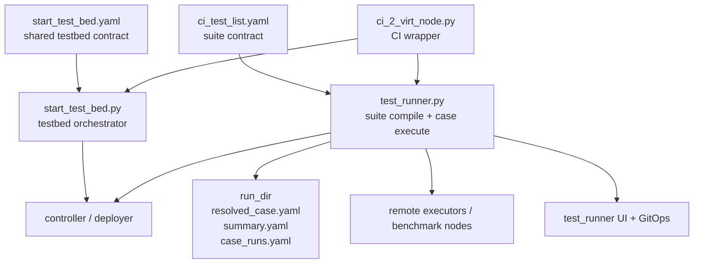
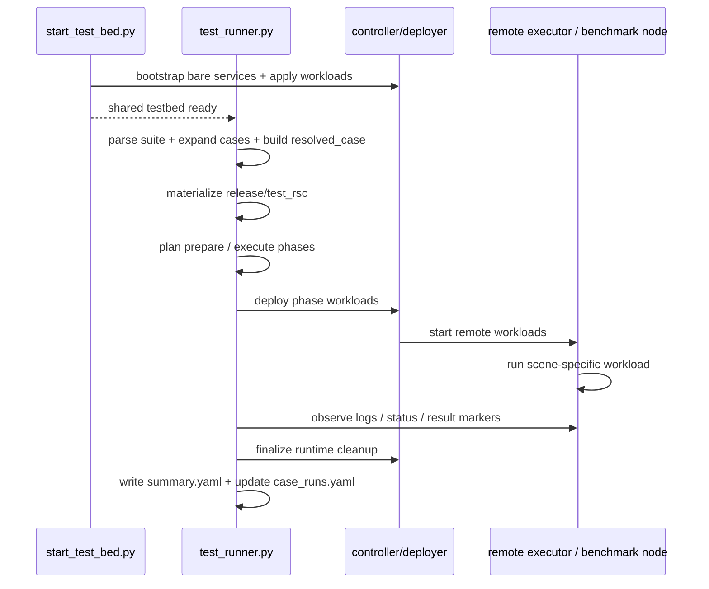

# TestStack 架构与 CI 测试流程

## 1. 背景与目标

本文说明 Fluxon 仓库中 `teststack` 的稳定架构，以及 `CI` 场景从 suite 配置到远端 `ci_runner` 完成执行的真实链路。

本文仅描述截至 2026-06 的稳定实现，不涉及未来重构规划。

**稳定结论：**

- `teststack` 由三层组成：
  - **上层：suite 编译层**：将 `scene × scale × profile` 组合成可执行 case；
  - **中层：统一 case plan / dispatch 层**：把编译结果收敛成统一的 `prepare / execute` 外壳，并按 runtime backend 分发；结果观测和终态落盘放在 execute / finalize 两段里完成；
  - **下层：runtime backend 执行层**：分别承接 `CI` backend 和 `TEST_STACK` backend 的具体 prepare、execute、finalize 实现。
- `test_runner.py` 是统一执行器，覆盖 `CI` case、`TEST_STACK` benchmark case，以及 UI / GitOps 集成入口。
- `test_runner.py` 当前主要承载上层和中层；`test_runner_runtime_backend.py` 承载下层 runtime backend 实现。
- `start_test_bed.py` 只负责共享 testbed 的启动与 controller 侧 apply 编排，不承担通用测试执行职责。
- `ci_2_virt_node.py` 是 GitHub Actions / 本地双逻辑节点 CI 的封装入口，负责串联打包、dispatch、拉起 testbed、运行 runner、构建文档等步骤。

## 2. 非目标

本文不展开这些内容：

- 不逐项解释每个 benchmark mode 的业务语义；
- 不展开 deployer 内部实现；
- 不展开 `fluxon_ops` / `manual_dispatch_release.py` 的内部细节；
- 不把 UI 页面的所有 API 细节写成接口文档。

## 3. 核心模块与职责

| 模块 / 文件 | 职责 | 不负责什么 |
| --- | --- | --- |
| `fluxon_test_stack/ci_test_list.yaml` | 定义 suite：`run`、`scenes`、`scales`、`artifact_sets`、`profiles` | 不直接执行任何 case |
| `fluxon_test_stack/test_runner.py` | 统一 runner。负责解析 suite、展开 case、生成 `resolved_case`、驱动 prepare / execute，并在 finalize 路径完成收尾 | 不直接拥有共享 testbed 的长期生命周期 |
| `fluxon_test_stack/start_test_bed.py` | 共享 testbed 启动协调器；负责 bare bootstrap 和 controller apply 顺序 | 不负责按 case 执行测试命令 |
| `fluxon_test_stack/start_test_bed.yaml` | testbed 启动契约；描述 bootstrap phases、controller、UI、deploy_workloads | 不定义单个 case 的测试命令 |
| `fluxon_test_stack/ci_2_virt_node.py` | 双逻辑节点 CI 封装；生成本地化 deployconf / start_test_bed 配置，并串起整条 CI 流程 | 不替代 `test_runner.py` 的 case 执行逻辑 |
| `fluxon_test_stack/gitops/gitops_lib.py` | `test_runner` 持有的 GitOps 轮询与历史记录逻辑 | 不单独拥有独立服务进程 |
| `fluxon_test_stack/test_runner_ui.py` / `test_runner.py --action ui` | 展示 suite 历史、run 状态、GitOps 状态、log | 不直接执行测试 |

## 4. 架构总览

`teststack` 可以按三层理解。



### 4.0 `test_runner` 内部的上中下分层

这里要把“teststack 三层”与“`test_runner` 内部三层”区分开看。

`teststack` 整体上仍然是：

- suite 编译层
- testbed 编排层
- case 执行层

但在 `test_runner` 自身内部，当前稳定实现已经进一步分成三层：

| 层级 | 作用 | 当前主要落点 |
| --- | --- | --- |
| 上层 | 解析 suite、selector、`scene/scale/profile`，并 materialize `resolved_case` | `test_runner.py` |
| 中层 | 将不同 case family 收敛成统一 `_CasePlan` 外壳，并负责统一 dispatch | `test_runner.py` |
| 下层 | 按 runtime backend 执行具体 runtime 逻辑 | `test_runner_runtime_backend.py` |

这里的关键点是：

- **上层统一的是 schema 和 case 编译模型**；
- **中层统一的是 `prepare / execute` 的外壳**；结果观测和 finalize 是 runner 级收尾，不是 `_CasePlan` 的 phase；
- **下层不再按 `scene/scale/profile` 切分，而是按 runtime backend 切分**。

这意味着：

- `scene / scale / profile` 仍是一套统一输入模型；
- `CI` 与 `TEST_STACK` 的差异，主要落在下层 runtime backend，而不是上层 schema。

当前对应关系可以简化理解为：

```text
scene / scale / profile
    -> resolved_case
    -> _CasePlan
    -> runtime backend dispatch
       -> CI backend
       -> TEST_STACK backend
```

### 4.1 suite 编译层

本层输入为 `ci_test_list.yaml`，主要定义三类核心对象与一类产物注册表：

- `scenes`：场景；
- `scales`：规模与目标机器；
- `profiles`：运行后端、deploy 模板，以及 profile 选用的 `artifact_set`；
- `artifact_sets`：suite 顶层的产物集合 registry，提供 release / test_rsc 的来源与产物名，再由 `profile.artifact_set` 引用。

**设计注记：`artifact_sets` 独立拆分的目的**

`artifact_sets` 的核心作用是解耦“逻辑运行配置”和“具体产物来源”。它允许同一类 Fluxon 运行配置映射到多套 release / test_rsc 产物，同时保持两层语义边界：

- `profile` 表达逻辑运行配置；
- `artifact_set` 表达具体产物束。

该拆分服务三类需求：

1. **避免重复**
   多个 profile 可以引用同一套 release / test_rsc 来源与文件名，不需要在每个 profile 下重复定义。
2. **分离运行参数与产物来源**
   `profile` 回答“如何运行”；`artifact_set` 回答“运行时使用哪套 wheel、哪套 test_rsc、从哪个 key_prefix 拉取”。
3. **支持同一逻辑 profile 映射到不同 concrete artifact set**
   Runner 在 `_resolved_case_artifact_set_id()` 中先读取 `profiles[*].artifact_set`。在部分 `TEST_STACK` 场景下，Runner 还会读取以下配置并重写 artifact set：

   ```text
   runtime.test_stack.runtime_config.kv_base.test_spec_config.p2p_transport_impl
   ```

   因此，同一个逻辑 profile / runtime 模板在 case 级别可能解析出不同的 release / test_rsc 组合。

更准确的归属关系如下：

- 语义归属上，它确实是被 profile 选用的产物集合；
- 结构设计上，它被单独抽成 suite 顶层 registry，是为了支持复用和后续按运行配置重写 concrete artifact set。

`test_runner.py` 读取这些对象后生成可执行 case。case 主键包括：

- `scene_id`
- `scale_id`
- `profile_id`

**结论**：suite 层负责定义 case 空间，不负责启动 testbed。

### 4.2 testbed 编排层

本层输入为 `start_test_bed.yaml` 与 `deployconf_testbed.yml`。

它回答的是另一类问题：

- controller 应该连到哪里；
- bare bootstrap 哪些服务先起；
- workload apply 顺序是什么；
- test_runner UI 是否随 testbed 一起起来。

`start_test_bed.py` 严格限定为协调器：

- 它只负责 bare launch wave、controller 可用性、ordered apply、apply wait；
- 它的副作用被限制在生成的 bare start/stop 脚本和 controller apply 接口上；
- 它不负责按 case 逐条执行测试命令。

### 4.3 case 执行层

本层由 `test_runner.py` 驱动。

它对每个 case 做三类动作：

1. 准备输入：release、test_rsc、运行时配置、远端 run_dir；
2. 执行主体并完成结果观测 / 落盘：远端 executor、benchmark node 或场景专用 workload；
3. finalize：回收 runtime、更新 `summary.yaml`、更新 `case_runs.yaml`。

**核心事实：**

- `test_runner.py` 是每个 case 的执行 authority；
- `case_runs.yaml` 是 suite workdir 下的执行状态单一事实来源；
- `summary.yaml` 是单次 run_dir 的终态摘要；
- `resolved_case.yaml` / `resolved_case_full.yaml` 是单次 run 的编译产物。

### 4.4 `test_runner.py` 与 `test_runner_runtime_backend.py` 的边界

当前 repo 内已经开始把 `test_runner` 主体按“统一编译/分发”和“runtime backend 执行”拆开。

稳定边界如下：

| 文件 | 主要职责 | 不负责什么 |
| --- | --- | --- |
| `fluxon_test_stack/test_runner.py` | 上层 suite/schema/case 编译；中层 `_CasePlan` 编译与统一 dispatch；runner 入口、workdir 历史、通用 util | 不再直接承载大段 `CI` / `TEST_STACK` backend 细节 |
| `fluxon_test_stack/test_runner_runtime_backend.py` | 下层 backend 运行逻辑：`_prepare_ci_case`、`_execute_ci_case`、`_prepare_test_stack_case`、`_execute_test_stack_case`、对应 finalize / result wait | 不解析 suite，不决定 `scene × scale × profile` 的组合空间 |

这层拆分的目的不是制造第二套 case 模型，而是把：

- **统一 case schema**
- **统一 `_CasePlan` 外壳**
- **不同 runtime backend 实现**

三者分开，避免把所有逻辑继续堆在一个 `test_runner.py` 里。

## 5. teststack 的公共契约

### 5.1 两类场景

suite 中有两大类场景：

| 场景类型 | suite 字段 | 执行方式 |
| --- | --- | --- |
| `CI` | `scene.ci` | 由 `test_runner.py` 生成 CI runtime，再把命令交给远端 `ci_runner.sh` 串行执行 |
| `TEST_STACK` | `scene.test_stack` | 由 `test_runner.py` 生成 benchmark config、coordinator、node runtime，并按 phase 执行 |

这两类场景共用同一个 runner，但编译和执行计划不同。

### 5.2 `teststack has two steps`

仓库根规则中的 “teststack has two steps: start testbed and testrunner” 可理解为稳定的外部使用契约：

1. `start_test_bed.py`
   - 解决共享环境是否已经准备好；
   - 让 controller / deployer 回到可接单状态；
   - 不运行单个测试 case。
2. `test_runner.py`
   - 解决 suite 下每个 case 怎么编译、怎么执行、怎么收尾；
   - 它依赖 testbed 已经存在，或者在 controller 离线时尝试触发一次 bootstrap。

这两个步骤描述职责分离；testbed 仍可包含 UI 或 GitOps 相关工作负载。

### 5.3 UI 归属

仓库规则要求：

- `testrunner should own the UI`
- `the UI should reuse the ops interfaces underneath`

实现已按该方向收敛：

- 这里的 “own the UI” 指归属和 authority，不指“把 UI 绑到某一次 case 执行进程上”；
- UI 服务由 `test_runner.py --action ui` 或 `test_runner_ui.py` 启动，并作为长生命周期进程常驻；
- 单次 case 运行结束后，UI 仍可继续读取 suite 历史、日志和 GitOps 状态；
- GitOps poller 也挂在同一个 test_runner UI 服务里；
- CI / TEST_STACK 的状态展示、日志读取、GitOps 状态都属于 test_runner 服务面；
- 底层实例状态和 workload 状态仍通过 controller / ops 接口读取。

### 5.4 UI 使用方式

**结论**：当前默认语义是“UI 服务独立常驻，测试执行按需运行”，不是“每次跑 `test_runner.py` 都自动拉起一个随 run 退出的临时 UI”。

实际有三种入口：

| 使用方式 | 是否自动拉起 UI | 适用场景 | 说明 |
| --- | --- | --- | --- |
| 直接运行 `test_runner.py` | 否 | 只想执行 suite | 默认 `action=run`，只执行 case，不启动 UI |
| 单独运行 `test_runner_ui.py` | 是，由你手动提前启动 | 想长期保留历史 / 日志 / GitOps 页面 | 推荐的人手操作入口 |
| 运行 `start_test_bed.py` 且 `start_test_bed.yaml` 中 `test_runner_ui.enabled: true` | 是，由 testbed 编排器代起或复用已有 UI | 共享 testbed 场景 | 如果探测到同配置 UI 已存在，会直接复用 |

推荐操作顺序如下：

1. 先启动 / 复用共享 testbed。
2. 确保常驻 UI 服务已就绪：
   - 要么显式运行 `test_runner_ui.py`；
   - 要么让 `start_test_bed.py` 按 `start_test_bed.yaml` 中的 `test_runner_ui` 配置代起。
3. 再运行 `test_runner.py` 执行 suite。

当前代码行为还要注意两点：

- `test_runner.py --action ui` 仍可用，但已经标记为 deprecated，推荐改用 `test_runner_ui.py`。
- `ci_2_virt_node.py` 会串起 dispatch、`start_test_bed.py` 和 `test_runner.py`，其中 UI 是否自动起来，取决于生成的 `start_test_bed` 配置里是否启用了 `test_runner_ui`。

## 6. 关键运行态对象

下表只列对理解通用架构有决定作用的对象。

| 对象 | 位置 | 作用 |
| --- | --- | --- |
| `case_runs.yaml` | `workdir_root/` | suite 级执行历史与状态的单一事实来源 |
| `results/<case_id>/run_<n>/summary.yaml` | 单次 run_dir | 单次 case run 的结果摘要 |
| `results/<case_id>/run_<n>/resolved_case.yaml` | 单次 run_dir | phase 级 deploy 输入视图，可能只包含部分 instance |
| `results/<case_id>/run_<n>/resolved_case_full.yaml` | 单次 run_dir | 稳定完整的 case 编译结果，用于 resume / repair |
| `fluxon_test_stack/test_runner/ui_history.yaml` | repo 内 runner 共享目录 | UI 历史索引 |

`CI` 场景会额外生成这些运行态对象：

| 对象 | 位置 | 作用 |
| --- | --- | --- |
| `results/<case_id>/run_<n>/ci_runner.sh` | 单次 CI run_dir | 远端 CI 执行脚本 |
| `results/<case_id>/run_<n>/ci_prepare_env.sh` | 单次 CI run_dir | prepare step 导出的环境变量 |
| `results/<case_id>/run_<n>/logs/ci_runner/stdout.log` | 远端 / 本地 run_dir | `ci_runner` 统一 stdout |
| `results/<case_id>/run_<n>/logs/ci_runner/exit_code.txt` | 远端 / 本地 run_dir | `ci_runner` 终态退出码 |

## 7. case 编译模型

### 7.1 suite 层通用输入

`ci_test_list.yaml` 为不同场景提供统一的 suite 输入。编译阶段会共同读取这些对象：

- `scene.select.scales`
- `scene.select.profiles`
- 被选中的 `scales[*]`
- 被选中的 `profiles[*]`
- 被 profile 引用的 `artifact_sets[*]`

通用编译目标是将 suite 中的逻辑选择解析成可执行 case。不同场景可以在此基础上追加自己的运行计划，例如 `CI` 的命令列表或 `TEST_STACK` 的 benchmark runtime。

### 7.2 多维约束关系如何处理

**结论**：这里不是“把 scene / scale / profile 做全局自由笛卡尔积，再靠后续逻辑兜底过滤”。当前实现是按固定顺序传播约束：

1. `scene.select`
   - 先定义这个 scene 允许搭配哪些 `scale` 和 `profile`；
   - 这是 case 空间的第一层边界。
2. `scene kind`
   - 决定当前 scene 走 `CI` 还是 `TEST_STACK` 分支；
   - 也决定后续必须存在哪些字段，例如 `scene.ci.runtime_contract` 或 `scene.test_stack.mode`。
3. `scale`
   - 提供 topology、targets、owner、benchmark 等“规模与布局”约束；
   - 这些约束不会自己决定 runtime 模板，但会限制哪些 runtime 模板能成功 materialize。
4. `profile`
   - 提供 `artifact_set` 绑定，以及 `runtime.ci` / `runtime.test_stack` 这类运行模板；
   - profile 必须覆盖当前 scene kind 需要的运行分支；
   - 当前不会根据 `scale` 自动推导 profile，但 profile 内部模板可以根据 `scale`、topology 和 run 上下文继续 materialize。
5. `artifact_set`
   - 由 profile 单点绑定；
   - release / test_rsc 的来源不是 scene 或 scale 自己再选一次。
6. `run.selectors`
   - 在 case 编译完成后，再做第二层过滤；
   - 主要裁剪 `profile_ids / case_ids / command_ids / test_ids`，不回写 scene / scale / profile 定义。

可以把它理解成：

- `scene` 负责定义“允许组合空间”；
- `scale` 负责定义“规模、拓扑和资源侧约束”；
- `profile` 负责定义“运行时模板和产物绑定”；
- `run.selectors` 负责定义“这次实际要跑哪一部分”。

当前编译顺序也是稳定的：`scene -> scale -> profile -> artifact_set -> resolved_case`。因此约束冲突会尽量在靠前层暴露，而不是拖到 deploy 阶段才发现。

这里需要把“选择 profile”和“展开 profile 模板”分开理解：

- `scene.select.profiles` 决定候选 profile 列表，属于显式选择。
- 进入某个 profile 之后，runner 才会把模板里的动态字段展开成具体值。
- 可动态展开的内容已经包括目录类路径、`__TARGET__`、`__INSTANCE_KEY__`、`__COORDINATOR__` 这类 deploy 占位符，以及 `port_alloc.by_topology` 这类按 topology 分支的资源分配。

### 7.3 多维约束的稳定规则

通用规则至少有这些：

- `scene.select.scales` 和 `scene.select.profiles` 只列举允许组合，不表达运行时细节。
- `profile` 的选择目前仍是显式枚举，不会由 `scale` 自动反推；动态分配发生在 profile 内部模板物化阶段，而不是 profile 选择阶段。
- `profile.artifact_set` 是单值绑定。一个 profile 在当前契约下只能指向一个 `artifact_set`。
- `run.selectors.profile_ids` 只能从已定义 profile 中挑选；它不会绕过 `scene.select.profiles` 去强行制造新 case。
- `case_id` 的逻辑主键固定是 `scene_id__scale_id__profile_id`。因此 case 维度的稳定身份只由这三个枚举决定。
- `case_key` 则是 `scene + scale + profile` 规范化内容的哈希；它反映配置快照，不替代 `case_id` 的逻辑身份。

不同场景还会追加自己的约束：

- `CI`
  - scene 选中的 profile 必须有 `runtime.ci`；
  - `scene.ci.runtime_contract` 必须能在该 profile 的 `runtime.ci.runtime_contracts` 中找到；
  - 选中的 scale 必须至少满足 `CI` 所需的 topology 基础字段。
- `TEST_STACK`
  - scene 选中的 profile 必须有 `runtime.test_stack`；
  - scene 的 `mode / subject` 必须和 test_stack backend 能力兼容；
  - scale 必须带 benchmark 相关字段；
  - scale 推导出的 role/target 计划，必须能落到 profile.deploy.target_ip_map 上。

### 7.4 典型失败方式

多维约束不满足时，runner 会在 case 编译阶段直接失败。常见失败包括：

- `scene.select.scales` 引用了不存在的 `scale`。
- `scene.select.profiles` 引用了不存在的 `profile`。
- `profile.artifact_set` 指向了不存在的 `artifact_set`。
- `CI` scene 选中了没有 `runtime.ci` 的 profile。
- `scene.ci.runtime_contract` 在选中 profile 的 `runtime.ci.runtime_contracts` 中不存在。
- `TEST_STACK` scene 选中了没有 benchmark block 的 scale。
- `TEST_STACK` role plan 推导出的 target，不在 profile 的 `deploy.target_ip_map` 里。
- `run.selectors.profile_ids` 或 `case_ids` 在编译后的 case 集合里选不中任何对象。

### 7.5 `resolved_case` 的作用

`test_runner.py` 不直接执行 suite YAML，而是先将每个 case 编译为 `resolved_case`。

`resolved_case` 至少会固化这些通用信息：

- case 元数据：`case_id`、`case_key`
- release / test_rsc 的物化位置
- workdir、run_dir、config_root
- stack identity：controller URL、ops cluster、共享路径
- deploy.instances
- `runtime_model`

这一步将“模板”和“单次 run 的具体值”分开：

- suite / profile 还在表达模板；
- `resolved_case` 已经变成可执行输入。

### 7.6 deploy.instances 的形成

deploy.instances 不写死在 suite 中。Runner 会结合 scale、profile 和场景 runtime 模板，把逻辑配置 materialize 成本次 case 的 deploy.instances。

这一层的稳定输入包括：

- `scale.topology`
- `scale.targets`
- profile 中的场景 runtime 模板

生成后的 deploy.instances 是后续 prepare / execute 输入的部署基础。实例集合和顺序必须稳定，因为后续执行计划会依赖它们。

### 7.7 `CI` 特化编译逻辑

`CI` scene 会在通用编译模型上追加这些字段：

- `scene.ci.subject`
- `scene.ci.runtime_contract`
- `scene.ci.prepare`
- `scene.ci.commands`

其中：

- `prepare` 是 CI case 的前置环境准备；
- `commands` 是 resolved case 里的编译产物字段，不是 suite 输入字段；`test_runner.py` 会按有限 `scene_id` 分支把它生成给 `ci_runner` 顺序执行；
- `runtime_contract` 决定 profile 里选哪套 runtime 模板。

已存在两个 runtime contract：

- `cluster_kv_owner`
- `rust_self_managed`

`_compile_ci_case()` 会根据：

- `scale.topology`
- `scale.targets`
- `profile.ci.runtime.case_runtime`

把 case runtime 模板 materialize 成本次 case 的 deploy.instances。

`CI` 特化的稳定事实：

- `CI_CASE_RUNTIME_INSTANCE_IDS = ("master", "owner_0", "ci_runner")`
- 最终是否包含这三个实例，取决于 runtime contract 模板里是否声明；
- `resolved_case` 会额外固化 `command_id`、`test_id` 等 CI 元数据；
- 生成顺序是稳定的，后续 phase 规划依赖这个顺序。

### 7.8 owner 模式配置契约

**稳定结论：**

- owner 模式配置一律必须显式提供 `fluxonkv_spec.large_file_paths`，并按数组顺序表达大文件根目录优先级。
- `fluxonkv_spec.p2p_listen_port` 不是 owner 模式的必填项；是否显式写入，取决于具体分支的运行契约。
- 不要把 `TEST_STACK` case-local owner 的显式端口分配规则，复制到 shared testbed / CI owner 配置上。

这里需要明确区分两类 owner 配置生成面：

| surface | `large_file_paths` | `p2p_listen_port` | 原因 |
| --- | --- | --- | --- |
| shared testbed / CI owner | 必填 | 默认省略，保持隐式 | 这类 owner 运行在共享环境里，宿主端口占用和 host 布局更易变化，保持由运行时自行绑定可用端口更稳妥 |
| `TEST_STACK` case-local owner | 必填 | 显式写入 | 同一 case 内的 node runtime 需要消费 runner 预编译的有限端口计划，owner peer 地址必须稳定 |

这条边界对应两种不同责任：

- `large_file_paths` 是 owner 模式本身的配置契约，缺失时应直接视为配置错误；
- `p2p_listen_port` 是否显式，则是某个运行 surface 的拓扑与端口规划策略，不应从一个 surface 横向推广到另一个 surface。

本次相关经验可以收敛成一句规则：

- owner 模式要显式约束的是 large-file roots，不是“默认必须写死 p2p 端口”。

## 8. case 执行流程

### 8.1 总体时序



### 8.2 phase 规划

`test_runner.py` 会先把每个 case 编译成 `_CasePlan`。这里有一个通用骨架：所有 case 都分成 `prepare_phases / execute_phases` 两段。不同场景的差异不在“两段结构本身”，而在于每段里放哪些 runtime phase、每个 phase 覆盖哪些 instance，以及 run_dir 怎样 staging。结果观测和 finalize 不属于 `_CasePlan`。

这里要明确：

- `_CasePlan` 属于中层统一外壳；
- `CI` 和 `TEST_STACK` 都要先落到 `_CasePlan`；
- 真正的 backend 差异，延后到下层 runtime backend 才展开。

通用语义如下：

- prepare phase 先准备场景依赖的 runtime、配置、脚本和共享目录；
- execute phase 执行场景主体 workload，并在需要时观测结果、写回摘要；
- finalize 路径做 runtime cleanup，并更新 `summary.yaml` / `case_runs.yaml`；
- phase 输入来自 `resolved_case.yaml`，完整视图保存在 `resolved_case_full.yaml`。

当前两类场景的 `_CasePlan` 形状如下：

| 场景 | prepare_phases | execute_phases |
| --- | --- | --- |
| `CI` | `cluster_runtime` | `ci_runner` |
| `TEST_STACK` / bench | `coordinator`、`node_runtime` | `nodes` |

`CI` 和 `TEST_STACK` 的结果观测、摘要写回和清理都在 execute / finalize 路径里完成，不再单独拆出额外的收尾阶段。

### 8.3 远端 run_dir staging

case 执行会将 run_dir 的一部分同步到远端。远端拿到的是带上下文的运行目录，而非单条 ssh 命令。

staging 内容由场景和 phase 决定，通常包括：

- configs；
- runtime 脚本；
- 共享目录；
- 场景专用执行脚本；
- release / test_rsc 物化结果。

`resolved_case.yaml` 因此会按 phase 重写：

- deployer adapter 每次只消费该 phase 需要的 instance 子集；
- 完整的 case 视图另存为 `resolved_case_full.yaml`。

### 8.4 观测、结果写回与 finalize

`test_runner.py` 是 case 执行的观测者和收敛者。它会根据场景定义的日志、状态和结果标记判断执行是否完成。

当场景主体 workload 返回终态后，`test_runner.py` 继续执行两类动作：

1. 结果观测与摘要写回
   - 读取 exit code、result file 或其他终态标记；
   - 把 run 结果写入 `summary.yaml`。
2. `finalize`
   - 更新 `case_runs.yaml`；
   - 做 runtime cleanup。

需要区分两个对象：

- `summary.yaml`
  - 代表某个 run_dir 的单次结果；
- `case_runs.yaml`
  - 代表整个 suite workdir 的执行历史与状态。

### 8.5 `CI` 特化：每段里放什么

`CI` 的特化点不是“两段结构本身”，而是两段里放的 phase 比较固定：

- prepare_phases
  - `cluster_runtime`
- execute_phases
  - `ci_runner`

CI 的结果观测靠 `ci_runner` 退出码和 runner 的 summary 写回完成，不再单独拆出额外的收尾阶段。

其中 prepare 阶段只负责 cluster runtime：

- 先把 `master` / `owner_0` 这类长生命周期 runtime 部署起来；
- 再把真正执行命令的 `ci_runner` 单独部署出来。

分层依据如下：

- `ci_runner` 是 job-like 执行者；
- `master` / `owner_0` 是它依赖的服务侧 runtime；
- 两者的 staging 内容和生命周期不同。

`CI` 至少存在两种 staging 视图：

| 视图 | 作用 |
| --- | --- |
| cluster runtime stage | 给 `master` / `owner_0` 运行时准备 configs、runtime 脚本、共享目录等 |
| ci_runner stage | 给 `ci_runner` 准备 `ci_runner.sh`、`ci_prepare_env.sh`、configs、`src`、`venv`，以及在某些 contract 下附带 `fluxon_release` / `test_rsc` |

### 8.6 `TEST_STACK` / bench 对照：每段里放什么

`TEST_STACK` / bench 同样走 `prepare / execute` 两段骨架，但段内 phase 不同：

- prepare_phases
  - `coordinator`
  - `node_runtime`
- execute_phases
  - `nodes`

`TEST_STACK` 的结果观测靠 benchmark result file 完成，finalize 负责收尾和清理，不再单独拆出额外的收尾阶段。

这些 phase 的职责分别是：

- `coordinator`
  - 部署 benchmark 协调者和 prepare 阶段需要的 service 型实例；
- `node_runtime`
  - 把 benchmark config 和 runtime bundle staging 到各个 benchmark node；
- `nodes`
  - 真正启动 job 型 benchmark node workload，并等待结果文件就绪。

所以 `bench` 也是两段。它和 `CI` 共用同一个 `_CasePlan` 外壳；真正的特化点是：

- `CI` 用单个 `ci_runner` job 串行执行命令列表；
- `TEST_STACK` / bench 用 `coordinator + node runtime + node jobs` 的多 phase 结构展开，结果观测和收尾由 execute / finalize 路径承担。

### 8.7 `CI` 特化：prepare 子步骤

`CI` 支持 case 级 `prepare` 子步骤。稳定支持的类型为：

- `kind: setup_dev_env`

以 `ci_top_attention_doc_page_build` 为例，prepare 会：

1. 调用 `setup_and_pack/setup_dev_env.py`
2. 按 `config` 指向的 setup 配置安装工具链
3. 如果声明了 `cache_relpath`，导出额外环境变量

`doc_page` 会导出：

- `FLUXON_CI_PREPARE_NODE_BIN`
- 更新后的 `PATH`

然后这些导出会被写入 `ci_prepare_env.sh`，由远端 `ci_runner.sh` 在真正执行命令前 source。

### 8.8 `CI` 特化：`ci_runner.sh` 的职责

`ci_runner.sh` 不只包装命令列表，还负责以下稳定动作：

- 统一把 stdout/stderr 重定向到 `logs/ci_runner/stdout.log`
- 检查是否已有 `exit_code.txt`
  - 如果已经有，说明这个 run 已经终态化，脚本只保活等待 controller stop
- source `ci_prepare_env.sh`
- 在需要 owner shared bundle 的 contract 下等待共享 bundle 就绪
- 跑 backend readiness probe
- 按顺序执行 suite 里展开后的 command 列表
- 在每个命令失败时写 `exit_code.txt`
- 在全部成功时写 `exit_code.txt=0`
- 写完退出码后不立即退出，而是继续 hold，直到 controller stop

**关键机制**：controller / runner 的终态收敛严格依赖 `exit_code.txt`，不依赖 shell 进程的瞬时退出。

### 8.9 `CI` 特化：`test_runner` 如何观测 `ci_runner`

`test_runner` 观测 `ci_runner` 的主路径如下：

1. 轮询 `logs/ci_runner/stdout.log`
2. 轮询 `logs/ci_runner/exit_code.txt`
3. 查询 controller 上对应 workload 的 instance status

`CI` 主流程的收敛条件为：

- 最终拿到一个稳定整数退出码；
- 如果 controller 已经没有该 `ci_runner` workload 的 desired state，则按规则收敛为失败。

GitHub Actions 主窗口中的许多日志并非本地直接打印，而是由 `test_runner` follow 远端 `ci_runner/stdout.log` 后转发。

## 9. `CI` 封装入口：`ci_2_virt_node.py`

`ci_2_virt_node.py` 是 CI 封装入口，不承担新的 case 执行框架职责。

它主要负责四件事：

1. 生成 same-host 双逻辑节点用的本地化 `deployconf` / `start_test_bed` 配置；
2. 执行 release / test_rsc 打包与 dispatch；
3. 调用 `start_test_bed.py`
   - 先做 bare bootstrap
   - 再做 apply validation
4. 调用 `test_runner.py`
   - 用 `ci_test_list.yaml` 跑 `CI` scenes

它解决的是“如何把一套 repo 在双逻辑节点环境里串成标准 CI 流程”。suite 编译和 case 执行职责仍由 `test_runner` 持有。

### 9.1 top-attention CI scene 与 wrapper 的边界

当前需要区分两层事实：

- `fluxon_test_stack/ci_test_list.yaml` 直接把 top-attention 项暴露为正式 CI scene。
- suite 不再声明 CI 命令字符串，也不再额外声明 `execution_model`；CI workload 分发统一内聚在 `test_runner.py` 的有限 `scene_id` 分支里。
- `test_runner.py` 会根据 `scene_id` 做 runner-native dispatch，把 case 转发到：
  - `__RUN_DIR__/venv/bin/python3 -u __RUN_DIR__/src/fluxon_test_stack/top_attention_test_index/_bin_kvtest.py --case-config __RUN_DIR__/configs/ci_scene_config.yaml`
  - `__RUN_DIR__/venv/bin/python3 -u __RUN_DIR__/src/fluxon_test_stack/top_attention_test_index/_doc_page_build.py --case-config __RUN_DIR__/configs/ci_scene_config.yaml`
  - `__RUN_DIR__/venv/bin/python3 -u __RUN_DIR__/src/fluxon_test_stack/top_attention_test_index/_cargo_fs_core.py`
  - `__RUN_DIR__/venv/bin/python3 -u __RUN_DIR__/src/fluxon_test_stack/top_attention_test_index/_cargo_util.py --case-config __RUN_DIR__/configs/ci_scene_config.yaml`
  - `__RUN_DIR__/venv/bin/python3 -u __RUN_DIR__/src/fluxon_test_stack/top_attention_test_index/_cargo_kv_unit.py --case-config __RUN_DIR__/configs/ci_scene_config.yaml`

这样做的稳定语义是：

- scene 粒度直接对齐 top-attention index 条目，不再并存第二层 `ci_rust` / `ci_doc_page` 划分；
- 实际 CI 路径仍由单次 `ci_2_virt_node.py` 调用统一拥有，但它只重写部署目标与 public profile，不再改写 workload 运行语义；
- GitHub Actions 里定义的 workload 配置会直接写入 suite profile 的 `runtime.ci.scene_configs`，随后由 `test_runner.py` 为每个 case 落一份 `configs/ci_scene_config.yaml`，再交给 `_bin_kvtest.py` / `_doc_page_build.py` 消费；
- 纯 crate 级 direct-cargo wrapper 可以保持最薄脚本入口，例如 `_cargo_fs_core.py`；
- 需要 runtime endpoint 或 feature 选择的 wrapper，则统一消费 `scene_config` / `scene_runtime`，例如 `_bin_kvtest.py`、`_cargo_util.py`、`_cargo_kv_unit.py`；
- `_bin_kvtest.py` 继续保持 thin wrapper，只负责把参数转发到 `cargo run --bin kv_test`，并补齐 active venv 的 native runtime lib 搜索路径。

因此，GitHub Actions 现在覆盖的是“由单一 `ci_2_virt_node.py` 入口启动，并通过 top-attention CI scene 执行 workload”这条真实 CI 路径，而不是在 suite 里再并存一层旧 scene。

## 10. GitOps 与 UI 的归属

GitOps 挂在 test_runner UI 服务下。这里的约束是不额外拆出第二个独立控制面服务，不是要求 UI 随某一次测试 run 一起退出。

结构如下：

- `gitops_lib.py`
  - 负责 GitOps context、轮询、历史记录、rerun 和日志读取；
- `test_runner.py --action ui`
  - 负责启动 UI 服务；
  - 如果传入 `--gitops-config`，同时持有 GitOps poller；
- `/api/gitops/*`
  - 由 test_runner UI 进程直接提供。

架构归属如下：

- GitOps 是 `test_runner` 的附属能力；
- UI 服务应以 long-running service 方式运行，独立于单次 case 生命周期；
- 测试执行 authority 仍由 `test_runner` 持有。

## 11. 约束、不变量与失败条件

### 11.1 稳定约束

- `case_runs.yaml` 是 suite workdir 的状态单一事实来源；
- `resolved_case_full.yaml` 是单次 run 的完整编译产物；
- `start_test_bed.py` 只负责共享 testbed 编排，不直接运行 case 命令；
- UI / GitOps 归 `test_runner` 服务拥有；
- UI 进程不应默认绑定到单次 case run 的生命周期。

`CI` 场景还有两条特化约束：

- `CI` case 必须有显式 `timeout_seconds`，runner 用它推导 `ci_runner` 总等待超时；
- `ci_runner` 的终态以 `exit_code.txt` 为准，不以“stdout 是否停了”或“shell 是否瞬时退出”为准。

### 11.2 容易误解的边界

| 容易误解的说法 | 真实情况 |
| --- | --- |
| `start_test_bed.py` 会执行整个测试 | 它只准备共享 testbed 和 apply workload |
| `ci_2_virt_node.py` 是测试执行器 | 它只是 CI wrapper，真正执行 case 的仍是 `test_runner.py` |
| `resolved_case.yaml` 永远是完整 case | 不一定。phase 执行期间它可能只包含该 phase 的 instance 子集 |
| UI 必须跟单次 test_runner run 同生共死 | UI 应由独立的 long-running test_runner UI service 提供 |
| GitOps 是独立服务 | 它通常附着在同一个 test_runner UI 服务里 |

`CI` 场景还需要额外避免这个误解：

| 容易误解的说法 | 真实情况 |
| --- | --- |
| `ci_runner` 一退出就表示 case 完成 | 不成立。收敛以 `exit_code.txt` 和 controller desired state 为准 |

### 11.3 失败条件

以下情况会导致 case 或 suite 失败：

- controller 未就绪且 bootstrap 也无法恢复；
- release / test_rsc 物化失败；
- deploy adapter 没产出预期结果；
- runtime cleanup / teardown 不收敛；
- 对 skipped case 的旧 apply desired state 清理不收敛。

`CI` 场景还会在以下情况失败：

- `ci_runner` 未写出合法整数 `exit_code.txt`。

## 12. 关键结论

- `teststack` 的核心是 `suite contract + testbed orchestrator + runner` 的三层结构。
- 对外部使用者来说，稳定的两步是：
  - 先准备 / 启动 testbed；
  - 再由 `test_runner.py` 执行 suite。
- 对 `CI` 实现来说，远端 `ci_runner.sh` 负责执行命令，`test_runner.py` 持有 case 执行 authority。
- `ci_2_virt_node.py` 只是把“本地双逻辑节点环境下的标准 CI 流程”封装出来，不改变 runner 的核心分层。
- UI 和 GitOps 都属于 `test_runner` 服务面；其中 UI 应作为常驻服务运行，不构成额外的测试执行框架。
